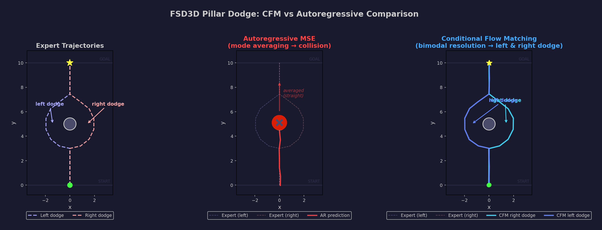
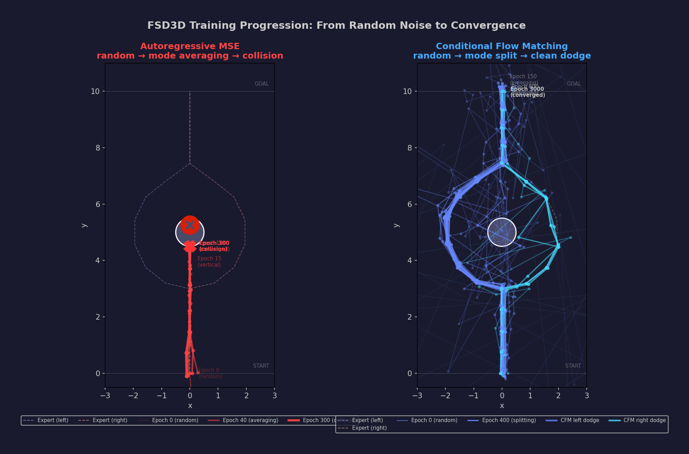

# FSD3D Decoder (§4 + §5) — CFM vs Autoregressive Comparison

The **decoder** sub-package implements §4 (Latent & Flight Generation) and §5 (Action Loop) of the FSD3D architecture. It contains the core model, training loops, inference routines, data assembly, and visualization — everything needed to train and evaluate the CFM vs AR comparison self-contained within this directory.


*Figure: §4 (Latent & Flight Generation) and §5 (Action Loop) are highlighted in the overall FSD3D architecture. The decoder receives context (K, V) from §1 + §2 + §3 Data Bridge, and Q from z_tau via §5 Action Projection. It outputs a clean flight plan z₁, which the §5 Action Head projects to a 16×4 trajectory horizon matrix.*

The expert trajectories are **bimodal Y-shaped paths**: the drone flies straight up a corridor, then dodges either left or right around a circular pillar, and continues straight up. With multimodal training data, the AR model averages both modes (x≈0) and flies straight into the pillar (collision), while the CFM model resolves a single clean trajectory that correctly dodges around the pillar.

---

## Visual Testing Overview

The purpose of this module is to **visually demonstrate** a fundamental limitation of autoregressive sequence models — **compounding drift** — and show how CFM's global resolution avoids it.



| Panel | What it shows |
|---|---|
| **Expert Trajectories** (left) | Two bimodal reference paths: straight up → left semicircle dodge → straight up, and straight up → right semicircle dodge → straight up |
| **Autoregressive MSE** (center) | AR averages both modes (x≈0), drift bias suppresses the dodge — the drone flies straight into the pillar and **crashes** (✕ icon). Trajectory stops at collision point |
| **Conditional Flow Matching** (right) | CFM resolves a **single trajectory** per click — either left dodge (blue) or right dodge (cyan), alternating direction every 2 consecutive same-direction runs |

> **Key insight:** AR models predict one step at a time, so an early error compounds into catastrophic failure. CFM models resolve the whole horizon at once, so local perturbations are corrected by the global velocity field.

---

## Self-Testing

### Prerequisites

```bash
# Install the fsd3d package (from project root)
pip install -e .
```

### Run all decoder tests

```bash
cd src/fsd3d/decoder
python -m pytest tests/ -v
```

> **Note:** On systems with the ROS `launch_testing` plugin installed, prepend
> `PYTEST_DISABLE_PLUGIN_AUTOLOAD=1` to suppress it:
> ```
> PYTEST_DISABLE_PLUGIN_AUTOLOAD=1 python -m pytest tests/ -v
> ```

### Run a specific test file

```bash
cd src/fsd3d/decoder
python -m pytest tests/test_model.py -v
python -m pytest tests/test_cfm.py -v
```

### Test coverage summary

| Test File | Tests | What it covers |
|---|---|---|
| `test_model.py` | 15 | **Architecture correctness** — decoder output shape, causal mask, time embedding, parameter count, start token, teacher forcing, ActionHead projection |
| `test_dataset.py` | 26 | **Data profile correctness** — left & right dodge trajectories, pillar avoidance, normalization, mirror symmetry |
| `test_cfm.py` | 5 | **CFM pipeline end-to-end** — loss decrease, interpolation, Euler ODE convergence |
| `test_autoregressive.py` | 6 | **AR pipeline end-to-end** — loss decrease, causal mask, noise + drift, generation shape |

---

## Training

```bash
cd src/fsd3d/decoder
python main.py
```

This trains both models (CFM: 5000 epochs, AR: 300 epochs) and saves everything to `workspace/`:

| Output file | Contents |
|---|---|
| `workspace/cfm_decoder.pt` | CFM decoder state dict (§4) |
| `workspace/cfm_action_head.pt` | CFM ActionHead state dict (§5) |
| `workspace/ar_wrapper.pt` | AR wrapper state dict (§4 + §5 + start token) |
| `workspace/z1.pt` | Target plan tensor (2, 16, 2) |
| `workspace/context.pt` | Context tensor (1, 32, 128) |
| `workspace/training_log.txt` | Full training log |

### Key hyperparameters

| Parameter | Value | Description |
|---|---|---|
| `d_model` | 128 | Transformer hidden dimension |
| `nhead` | 4 | Number of attention heads |
| `num_layers` | 3 | Stacked decoder layers |
| `dim_feedforward` | 512 | FFN inner dimension |
| `batch_size` | 64 | Training mini-batch |
| `epochs_cfm` | 5000 | CFM training epochs (cosine LR) |
| `epochs_ar` | 300 | AR training epochs |
| `euler_steps` | 20 | ODE integration steps for CFM inference |
| `ar_noise_sigma` | 0.06 | x-only noise from AR step 2 (normalized space) |
| `ar_continuous_noise` | True | Continuous x-only noise prevents mode commitment |
| `ar_drift_bias` | 0.97 | X-coordinate suppression (mode averaging → crash) |
| `dodge_radius` | 2.0 | Semicircle radius around pillar center |
| `trajectory_scale` | 10.0 | Normalization factor (real-space y goes up to 10) |

---

## Visualization

After training, run the interactive visualizer:

```bash
cd src/fsd3d/decoder
python visualize.py
```

> **Note:** This requires a graphical display (TkAgg backend). On headless systems,
> set `MPLBACKEND=Agg` and the figure will be saved instead of displayed.

### What you will see

A matplotlib figure with two side-by-side subplots. Both show the left and right expert trajectories as dashed reference lines.

**Left — Autoregressive MSE:**
- A red trajectory grows step-by-step.
- From step 2, continuous x-only noise plus drift bias (0.97) suppresses the x-coordinate — the AR model averages both modes and flies straight.
- The red line **crashes into the circular pillar** — the trajectory **never reaches the top**.
- A red **✕ failure icon** appears at collision.
- Previous AR trajectories are shown in **grey**.

**Right — Conditional Flow Matching:**
- A **single** CFM trajectory grows step-by-step, resolving to either a **left dodge** (blue) or **right dodge** (cyan).
- Direction alternation rule: if the last 2 trajectories went the same direction, the next is forced opposite.
- Previous CFM trajectories are shown in **grey**.

**Controls:**
- Click **"Generate Trajectory"** to re-seed and replay.

### Training Progression

```bash
cd src/fsd3d/decoder
python visualize_training.py
```

Generates `image/training_progression.png` showing both models at increasing training epochs.



#### How to read the figure

| Stage | AR (left panel, red) | CFM (right panel, blue/cyan) |
|---|---|---|
| **Epoch 0** — random | Untrained model outputs random positions near the origin | Untrained model outputs random positions near the origin |
| **Early epochs** — learning | Model learns the vertical corridor structure | Model learns the general flow direction |
| **Mid epochs** — averaging / splitting | AR averages both dodge modes → x suppressed toward 0 | CFM starts splitting into two distinct modes |
| **Final epochs** — collision / converged | Straight line (x≈0) crashes into the pillar — ✕ icon | Each sample cleanly resolves to left or right dodge |

### Generate README diagram

```bash
cd src/fsd3d/decoder
python generate_diagram.py
```

Generates `image/pillar_dodge_comparison.png` — the three-panel static figure shown above.

---

## Module Structure

```
src/fsd3d/decoder/
├── README.md              # This file — self-testing documentation
├── main.py                # Entry point: train both paradigms, save checkpoints
├── visualize.py           # Interactive side-by-side animation
├── visualize_training.py  # Training progression figure
├── generate_diagram.py    # Generate static README illustration
├── transformer.py         # §4 FSD3DTransformerDecoder
├── action_projection.py  # §5 ActionProjection (z_tau → Q)
├── action_head.py         # §5 ActionHead
├── autoregressive.py      # AutoregressiveWrapper (causal mask + start token)
├── context.py             # ContextAssembler, constants, trajectory utilities
├── tests/
│   ├── conftest.py        # pytest configuration
│   ├── test_model.py      # Architecture correctness tests
│   ├── test_dataset.py    # Data profile correctness tests
│   ├── test_cfm.py        # CFM pipeline tests
│   └── test_autoregressive.py # AR pipeline tests
└── workspace/             # Created by main.py — checkpoints and logs
```

---

## Architecture

Both paradigms use the **exact same** `FSD3DTransformerDecoder` (§4) + `ActionHead` (§5):

```
§4 — FSD3DTransformerDecoder (Latent & Flight Generation)
───────────────────────────────────────────────────────────
Input: z_τ [B, 16, 2]  +  τ [B, 1]  +  context [B, 32, 128]
  │
  ├─ action_projection: §5 ActionProjection (2 → 128)  — maps z_tau → Q
  ├─ position_embedding:  (1, 32, 128)  learned
  ├─ time_embedding:      Linear(1 → 128)
  │
  ▼
  TransformerDecoder (3 layers, 4 heads, dim_ff=512, Post-LN)
  │
  ▼
  LayerNorm(128)
  │
  ▼
Output: [B, 16, 128]  latent features

§5 — ActionHead (Action Loop)
───────────────────────────────
Input: [B, 16, 128]  latent features from §4
  │
  ▼
  Linear(128 → 2)  (zero-initialised)
  │
  ▼
Output: [B, 16, 2]  (velocity field for CFM / position predictions for AR)
```

The `AutoregressiveWrapper` chains §4 + §5 and adds:
- A learned `start_token` parameter (1, 2)
- Causal masking (`-inf` above diagonal)
- Step-by-step generation logic with optional noise and drift bias

### Architecture Diagram → Code Mapping

| Diagram Section | Component | Our Code | Training | Inference |
|---|---|---|---|---|
| **§1 Pilot Space** | 2D Video → ViT → 3D Tokens | `ContextAssembler` — static `(1, 32, 128)` Xavier tensor | Not trained | Used as **K, V** memory bank |
| **§2 Conditioning** | Telemetry + A* → Conditioning Tokens | Same `context` tensor | Not trained | Used as **K, V** memory bank |
| **§3 Data Bridge** | VisualAdapter + ContextNormalizer → 32 Tokens | Same `context` tensor | Not trained | Used as **K, V** memory bank |
| **§4 Latent & Flight Gen** | z0 → Cross-Attn → Decoder → CFM ODE → z1 | `FSD3DTransformerDecoder` | **Trained here** | ODE integration (CFM) or roll-out (AR) |
| **§5 Action Loop** | Action Projection → Action Head D → Trajectory | `ActionProjection` (Linear 2→128) + `ActionHead` (Linear 128→2) + `denormalize_trajectory()` | Trained jointly with §4 | Projects z_tau → Q, then latent → action-space positions |
